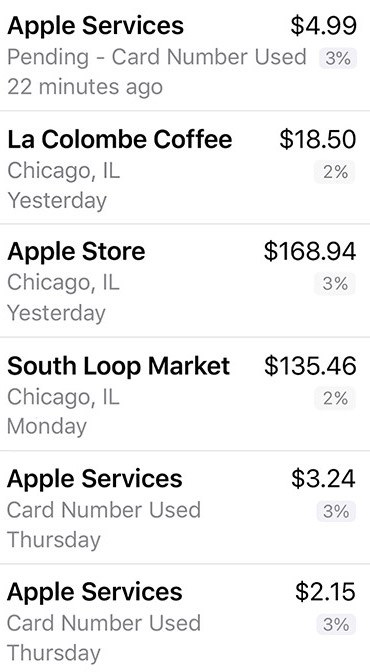

# CardVision

# Deprecated

Since as of [iOS 17.4](https://www.macrumors.com/2024/03/05/apple-card-ios-17-4-budget-apps/) Apple allows budget apps to directly import real-time transaction data, this project have been depreacted. Apple's API is much more reliable than OCRing screenshots.

## Overview

### Purpose

While the Wallet app provides exports for Apple Cards at the end of each month, many of us like to handle our budgets on a more frequent basis. However, the Wallet app provides no mechanism for this. This package uses Apple's Vision framework to read Wallet screenshots and export transactions to CVS files.

### Supported Plaforms

* macOS 10.15+
* iOS 13+

## Limitations

* Screenhots must be cropped such that only transaction information, without icon, is shown as in the following example:



* CardVision does not currently attempt to deduplicate transactions that show up in multiple screenshots.

## Commandline tool

### Installation

`brew install bergquester/bergquester/cardvision`

### Usage

`cardvision -imagePath <path_to_cropped_images> -outputPath <path_to_output_file>`

## Swift Package

### Requirements

* Xcode 11+
* No external dependancies!

### Installation

Use Swift Package Manager.

### Example

```
import CardVision

let filePath = "path_to_directory_of_images"

let csvData = FileManager()
    .images(inPath: filePath)
    .allTransactions()
    .filtered(isDeclined: false)
    .csvData
```

## Contributions

Contributions are welcome. Some areas that need some help:

* Real error handling
* API documentation
* Tests and test data
* Address limitations

## Liscense

[MIT](Liscense)
